# My Advent of Code

<!-- AOC TILES BEGIN -->
<h1 align="center">
  2022 - 32 ⭐
</h1>
<a href="src/Day01.kt">
  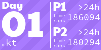
</a>
<a href="src/Day02.kt">
  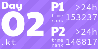
</a>
<a href="src/Day03.kt">
  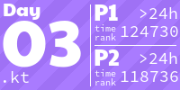
</a>
<a href="src/Day04.kt">
  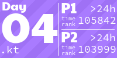
</a>
<a href="src/Day05.kt">
  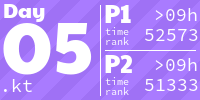
</a>
<a href="src/Day06.kt">
  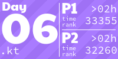
</a>
<a href="src/Day07.kt">
  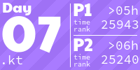
</a>
<a href="src/Day08.kt">
  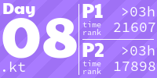
</a>
<a href="src/Day09.kt">
  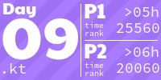
</a>
<a href="src/Day10.kt">
  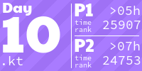
</a>
<a href="src/Day11.kt">
  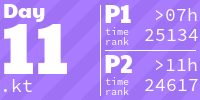
</a>
<a href="src/Day12.kt">
  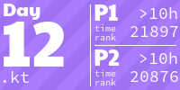
</a>
<a href="src/Day13.kt">
  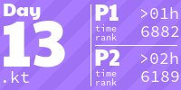
</a>
<a href="src/Day14.kt">
  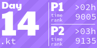
</a>
<a href="src/Day15.kt">
  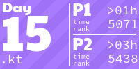
</a>
<a href="src/Day16.kt">
  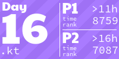
</a>
<!-- AOC TILES END -->

---
The graphic above has been created with the [AoCTiles script][aoc-tiles].

---
Repository created using the [Advent of Code Kotlin Template][template] delivered by JetBrains.

---
[Advent of Code][aoc] – An annual event of Christmas-oriented programming challenges started December 2015. Every year since then, beginning on the first day of December, a programming puzzle is published every day for twenty-five days. You can solve the puzzle and provide an answer using the language of your choice.

[aoc]: https://adventofcode.com
[aoc-tiles]: https://github.com/LiquidFun/adventofcode/tree/main/AoCTiles
[docs]: https://kotlinlang.org/docs/home.html
[template]: https://github.com/kotlin-hands-on/advent-of-code-kotlin-template
